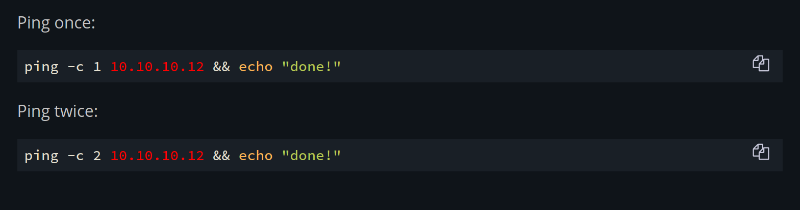
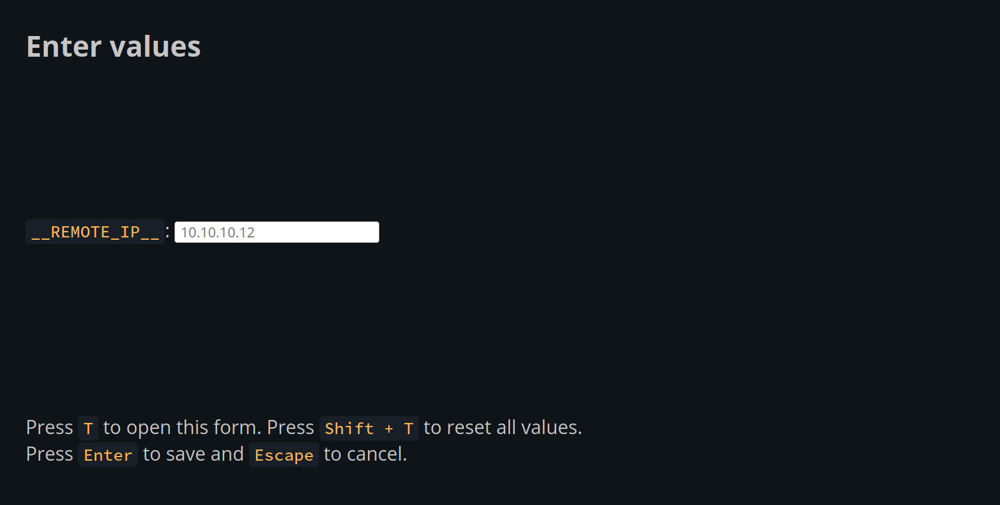
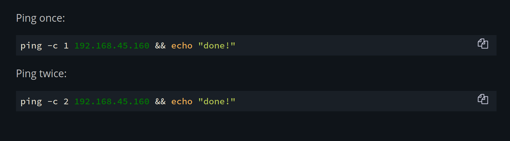

# `mdbook` dynamic templates

This is an addon for [`mdbook`] which adds support for "Dynamic Templates".

## What are Dynamic Templates?

A Dynamic Template is just a magic string, like `__REPLACE_ME__`. What this addon will do is search
for all occurrences of `__REPLACE_ME__` in `<code>` tags and replace it will a value that can be
changed when viewing the webpage (hence "dynamic").

This makes copyable snippets in code blocks more useful, for example, let's say you had a series of snippets of oneliner bash scripts that used IP addresses:

    Ping once:

    ```bash
    ping -c 1 10.10.10.10
    ```

    Ping twice:

    ```bash
    ping -c 2 10.10.10.10
    ```

And you were tired of copying the commands, and then changing the IP address when you use it.

With Dynamic Templates you can replace the dynamic value with a template, like this:

    Ping once:

    ```bash
    ping -c 1 __REMOTE_IP__
    ```

    Ping twice:

    ```bash
    ping -c 2 __REMOTE_IP__
    ```

Now, when you view the page it will look like this:



The colour shown indicates that the value is a default (or "fallback" value). Now, if you press `T` it will open a prompt:



And if you change the value, the templates now look like this:



Bask in the glory of Dynamic Templates.

## Installation

Clone this repository into your `mdbook`'s folder (next to the `book.toml` file):

```bash
cd path/to/your/book
git clone https://github.com/acheronfail/mdbook-dynamic-templates
```

Add the following to `book.toml`:

```toml
# Add the dynamic templates styles and scripts to your mdbook.
[output.html]
additional-js = ["dynamic-templates/index.js"]
additional-css = ["dynamic-templates/index.css"]

# The preprocessor ensures that if the renderer is not the HTML renderer then the
# templates will be replaced with fallback values.
[preprocessor.dynamic-templates]
command = "dynamic-templates/preprocessor.py"
```

## Defining Templates

The addon looks for templates defined in a `dynamic-templates.json` file located at the root of the website.
You can simply add a `dynamic-templates.json` file at the root of your `mdbook` source folder.

The templates file should have the following format:

```js
[
  {
    // This value in the outputted HTML will be replaced dynamically.
    "template": "__MY_TEMPLATE__",
    // The default value, and also what is rendered in non-HTML renderers.
    "fallback": "default_value"
  },
  // ...
]
```

## License

Either the `MIT`, `Unlicense` or `Apache 2.0`; at your option. See the `LICENSE-*` files in the repository.

[`mdbook`]: https://github.com/rust-lang/mdBook/
